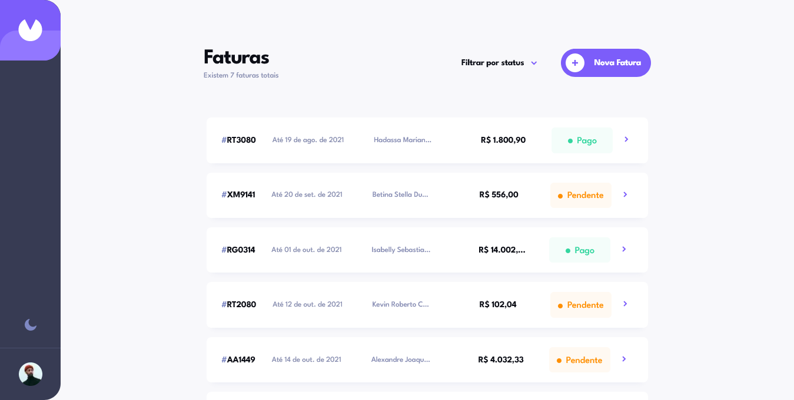
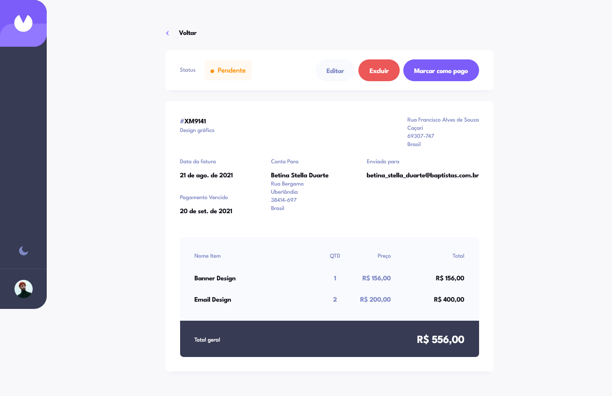
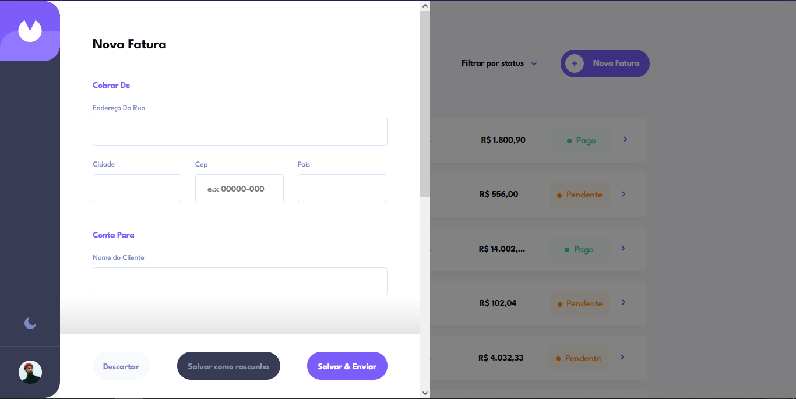
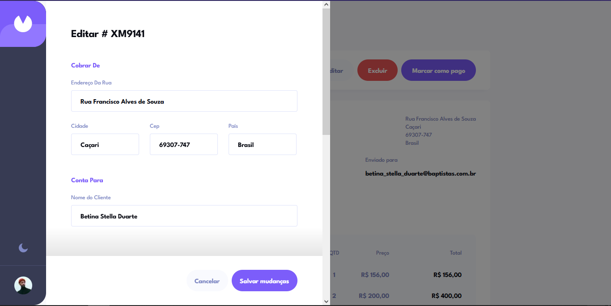
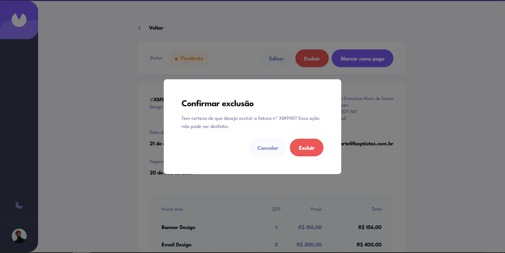

# Aplicativo Web de fatura

## Índice

- [Visão Geral](#visão-geral)
  - [O desafio](#o-desafio)
  - [Captura de tela](#captura-de-tela)
  - [Links](#links)
- [Meu processo](#meu-processo)
  - [Construído com](#construído-com)
- [Autor](#autor)

## Visão geral

### O desafio

Os usuários devem ser capazes de:

- [x] Veja o layout ideal para o aplicativo, dependendo do tamanho da tela do dispositivo
- [x] Veja os estados de foco para todos os elementos interativos na página
- [x] Criar, ler, atualizar e excluir faturas
- [x] Receber validações de formulário ao tentar criar/editar uma fatura
- [x] Salve rascunhos de faturas e marque as faturas pendentes como pagas
- [x] Filtrar faturas por status (rascunho/pendente/pago)
- [x] Alterna entre modo claro e escuro
- **Bônus**: Acompanhe todas as alterações, mesmo depois de atualizar o navegador (`localStorage` pode ser usado para isso se você não estiver criando um aplicativo full-stack)

### Comportamento esperado

- [x] Criação de fatura
  - [x] Ao criar uma nova fatura, é necessário criar um ID. Cada ID deve ter 2 letras maiúsculas aleatórias seguidas por 4 números aleatórios.
  - [x] As faturas podem ser criadas como rascunhos ou pendentes. Clicar em "Salvar como rascunho" deve permitir que o usuário deixe qualquer campo de formulário em branco, mas deve criar um ID se não existir e definir o status como "rascunho". Clicar em "Salvar e enviar" deve exigir que todos os campos do formulário sejam preenchidos e deve definir o status como "pendente".
  - [x] Alterar o campo Termos de Pagamento deve definir a propriedade `termosPagamento` com base na data `criadoEm` mais os números de dias definidos para os termos de pagamento.
  - [x] O `total` deve ser a soma de todos os itens da nota fiscal.
- [x] Editar uma fatura
  - [x] Ao salvar alterações em uma fatura, todos os campos são obrigatórios ao clicar no botão "Salvar alterações". Se o usuário clicar em "Cancelar", todas as alterações não salvas devem ser redefinidas.
  - [x] Se a fatura que está sendo editada for "rascunho", o status precisa ser atualizado para "pendente" ao clicar no botão "Salvar alterações". Todos os campos são obrigatórios nesta fase.
- [x] Os usuários devem poder marcar as faturas como pagas clicando no botão "Marcar como pagas". Isso deve alterar o status da fatura para "pago".
- [x] Os usuários devem receber um modal de confirmação ao tentar excluir as faturas.
- [x] Sinta-se à vontade para não adicionar estilo personalizado para os campos de formulário de data e dropdown. Os designs para esses campos são extras opcionais e são principalmente para fins de ilustração.

### Captura de tela











### Links

- Repositório do Projeto: [Repositório do Projeto](https://github.com/Samuel-Amaro/app-web-faturamento)
- Resultado ao vivo: [Adicione URL do site ao vivo aqui](https://app-web-faturamento.vercel.app/)

## Meu processo

### Construído com

- Marcação HTML5 semântica
- Acessibilidade HTML com arias atributos e roles
- CSS(Flexbox, Grid, Bem Metodologia, Mobile-First, Responsive Web Design, Normalize)
- Typescript
- NPM
- [React](https://reactjs.org/) - Biblioteca JS
  - hooks(useState, useEffect, useReducer, custom hooks)
  - Gerenciamento Estado - Context API com reducers
  - [React-Hook-Form](https://www.react-hook-form.com/) - Hook Gerenciamento Form
- [Next.js](https://nextjs.org/) - Next App Router
  - Client Components
  - Metadatas Static, and dinamic
  - Loading UI
  - Route Handles
  - Page Error Handling
  - Parallel Routes
- [CSS Modules](https://github.com/css-modules/css-modules) - Para estilos
- [LocalStorage Web API Browser](https://developer.mozilla.org/en-US/docs/Web/API/Web_Storage_API/Using_the_Web_Storage_API) - Armazenar Dados

## Autor

- Website - [Portfólio Web](https://samuel-amaro.github.io/portfolio-web/)
- Frontend Mentor - [@samuel-amaro](https://www.frontendmentor.io/profile/Samuel-Amaro)

## Começando

Este é um projeto [Next.js](https://nextjs.org/) inicializado com [`create-next-app`](https://github.com/vercel/next.js/tree/canary/packages /criar-próximo-aplicativo).

Primeiro, execute o servidor de desenvolvimento:

```bash
npm run dev
# ou
desenvolvedor de fios
# ou
desenvolvedor pnpm
```

Abra [http://localhost:3000](http://localhost:3000) com seu navegador para ver o resultado.

Você pode começar a editar a página modificando `app/page.tsx`. A página é atualizada automaticamente conforme você edita o arquivo.

Este projeto usa [`next/font`](https://nextjs.org/docs/basic-features/font-optimization) para otimizar e carregar automaticamente Inter, uma fonte personalizada do Google.
